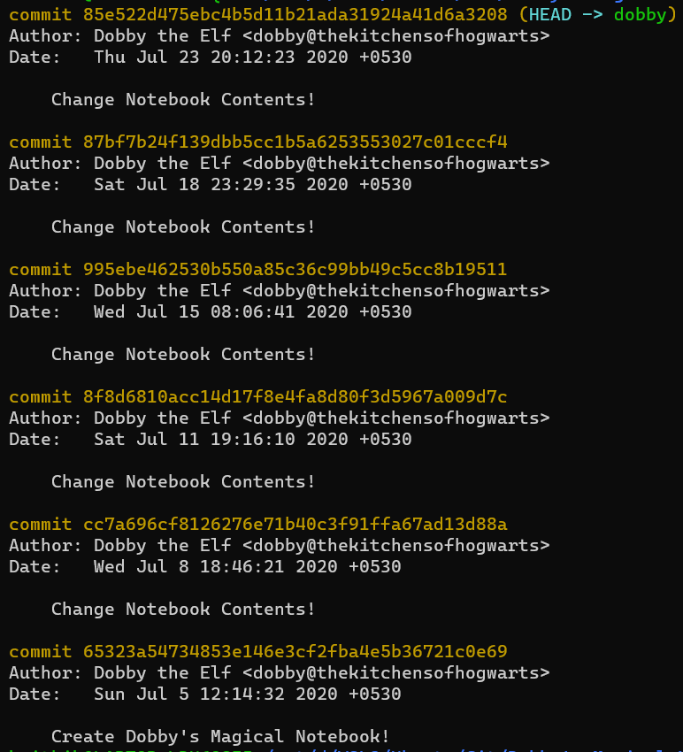
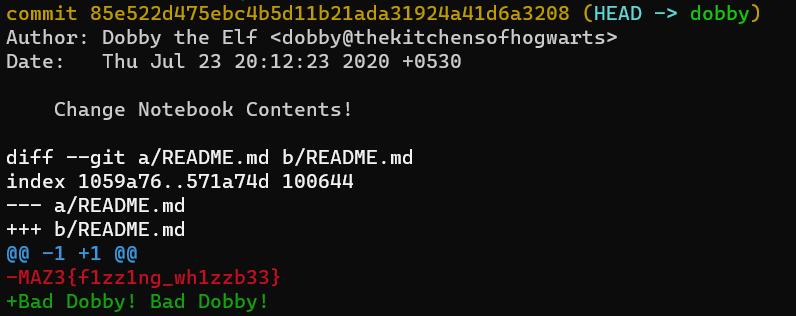

# Dobby was a free Elf

## Problem Statement

Harry Potter had entrusted Dobby with a very special secret password. Unfortunately, Dobby accidentally misplaced it and is constantly punishing himself for this. Please help Dobby find the secret -- otherwise, he will never forgive himself for losing the confidence of his beloved wizard.

**Note**: There are two flags that you may find, only one of them is right. The correct one is related to the Harry Potter universe.

[Dobby's Magical Notebook](https://drive.google.com/drive/folders/1KICwXuJ_vYtKUxWYcn2EwDyhO7GNH3VT?usp=sharing)

## [Editorial Solution](Algorithms/template/answer-template.md)

On downloading the folder and inspecting its contents, you'll see a _README.md_ and a _.git_ folder, indicating that this folder is a Git repository. The _README.md_ contains the text -

> This is the *master*'s notebook!

And the git log shows a single commit, which is a dead end.

However, the word *master* is also the name of the primary Git branch for a repository. This hints us towards checking what other branches are present in the repo. Running _git branch_ shows us two branches:

```
dobby
master
```

Changing to branch _dobby_ with ```git checkout dobby``` and checking the README, we can see that the contents have changed to

> Bad Dobby! Bad Dobby!

And inspecting the Git log for this branch ("Dobby's Magical Notebook"), we can see that Dobby has overwritten his notebook multiple times



Running _git show_ reveals that the flag had been overwritten by Dobby in the most recent commit:



Final flag: ```MAZ3{f1zz1ng_wh1zzb33}```