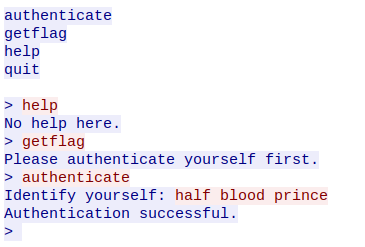

# JustGetIt0

## Problem Statement

There's a tcpserver running on 52.23.250.203 at port 11111 and we've only a [pcap dump](server0.pcap) of a conversation with the server.
Could you look at the file and get the flag yourself?

## [Editorial Solution](Algorithms/template/answer-template.md)

If we try accessing the flag, we get the error message saying ```Please authenticate yourself first.```

So, let's try to authenticate ourselves first.
But not knowing how to, let's turn to the pcap file provided.

Using wireshark, we can see a lot of data here, but on applying appropriate filters for our server (i.e., `tcp.port==11111`), we can see that there's one tcp stream available for us.
Checking the data in that stream, we can see that someone had authenticated themselves as "half blood prince" and the server successfully accepted that authentication.



Using this information, if we now try to authenticate and then view the flag, we get the flag.

```MAZ3{H4rry_P00tt3r_i5_m1n3}```

<!-- Add other solutions below -->
<!-- ### [Anon's Solution](Algorithms/template/answer.md) -->